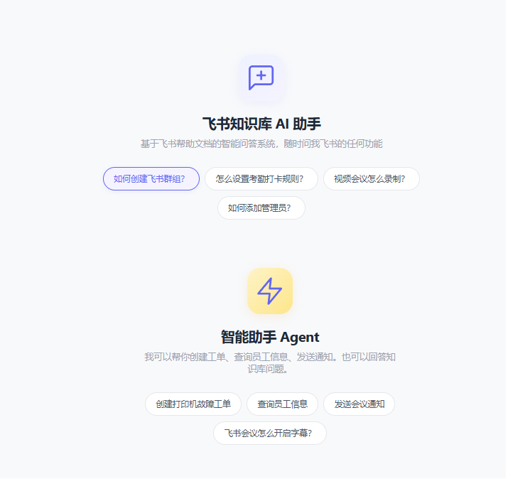
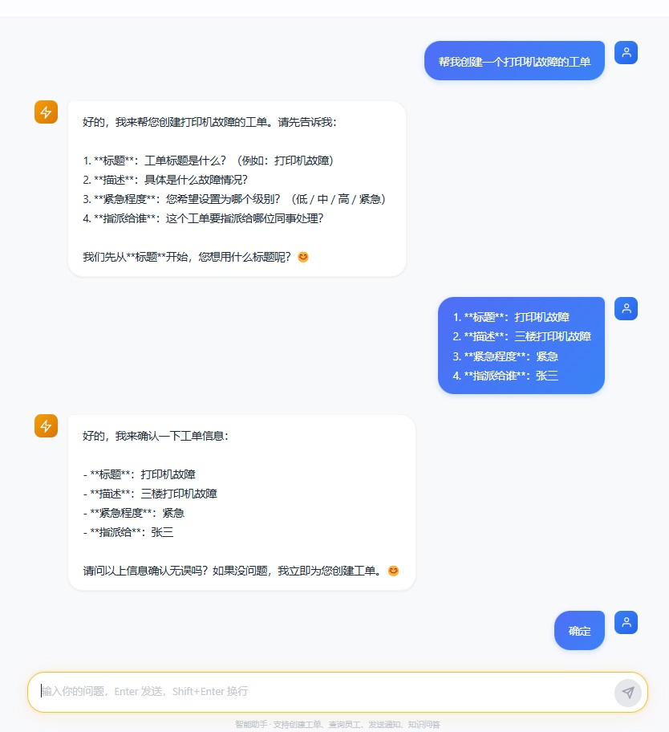
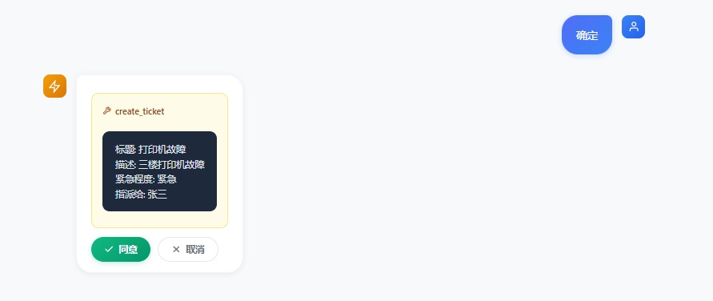
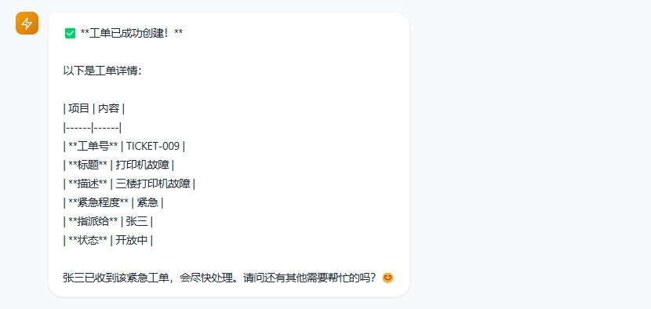

# KBQA — 智能知识库问答 + Agent 工单助手

知识问答：让员工告别翻阅上百篇文档，用自然语言提问，秒级准确答案。
Agent 助手：自动创建工单、查询员工信息、发送通知，支持多轮槽位填充与敏感操作确认。

典型场景：企业内部知识库、IT 工单系统、客服辅助。支持 Markdown/PDF/Excel 知识库，Agent 工具通过 DeepSeek function calling 自动调用。

> **技术栈**：Vue 3 · FastAPI · LangChain · ChromaDB · BGE · DeepSeek · MySQL · PyMuPDF

---

## 效果展示

### 1. web端主页



### 2. RAG 知识库来源追溯 — 原文引用展开


### 3. Agent 工单创建与确认







---

## 技术架构

```
┌──────────────────────────────────────────────────────────────┐
│                     Frontend (Vue 3)                          │
│              ChatGPT 风格 UI · 知识问答 / 智能助手双模式        │
│                    localhost:5173                              │
└──────────────────────────┬───────────────────────────────────┘
                           │  POST /chat  ·  /agent/chat
                           ▼
┌──────────────────────────────────────────────────────────────┐
│                    Backend (FastAPI)                          │
│                     localhost:8000                             │
│                                                               │
│  ┌──────────┐  ┌────────────┐  ┌───────────────────────────┐ │
│  │  API 层  │  │  模型定义   │  │      服务层 (RAG + Agent)   │ │
│  │  /chat   │  │  schemas   │  │                             │ │
│  │  /agent  │  │            │  │  rewriter → vectorstore     │ │
│  └──────────┘  └────────────┘  │      ↓                      │ │
│                                 │  reranker → llm            │ │
│  ┌──────────────────────────┐  │                             │ │
│  │     Agent 引擎             │  │  router → agent_executor   │ │
│  │  classify_intent          │  │      ↓                      │ │
│  │  → RAG 链路                │  │  tools (员工查询/建单/通知) │ │
│  │  → Agent 链路 (ReAct)      │  │      ↓                      │ │
│  │  → confirmation 确认机制    │  │  state_manager (会话槽位)  │ │
│  └──────────────────────────┘  │                             │ │
│                                 │  loader_manager            │ │
│  ┌──────────────────────────┐  │    ├── MarkdownLoader      │ │
│  │     Ingest Pipeline       │  │    ├── PdfLoader           │ │
│  │  load → clean → split     │  │    └── ExcelLoader          │ │
│  │    → filter → embed       │  │                             │ │
│  └──────────────────────────┘  └───────────────────────────────┘
└─────────────────────────────────────────────────────────────────┘
       │                  │                    │
       ▼                  ▼                    ▼
┌────────────┐  ┌──────────────────┐  ┌──────────────────┐
│  ChromaDB  │  │  BGE Embedding   │  │  DeepSeek API    │
│  MySQL     │  │  (bge-small-zh)  │  │  (function call) │
└────────────┘  └──────────────────┘  └──────────────────┘
```

---

## 核心特性

### 多格式知识库

| 格式 | 状态 | 实现 |
|------|------|------|
| Markdown (.md) | ✅ 已实现 | 递归读取 + 正则清洗（去图片/链接/视频噪声） |
| PDF (.pdf) | ✅ 已实现 | PyMuPDF 逐页提取 + 页码过滤 |
| Excel (.xlsx) | ✅ 已实现 | pandas 逐 sheet 结构化转自然语言文本 |

所有格式通过统一的 `BaseLoader` 接口接入，新增格式只需实现子类并在注册表加一行。

### 智能检索链路

```
用户提问 → Query Rewriting → 向量检索 Top-10 → 混合 Reranker Top-5 → LLM 生成
```

- **Query Rewriting**：LLM 将口语化短句（"这个怎么关"）改写为完整检索语句（"飞书消息通知的关闭方法"），改写失败自动降级
- **Hybrid Reranker**：70% 向量相似度 + 30% 关键词 bigram 重叠，权限/功能类问题自动加权
- **Metadata 透传**：全链路保留 `document_id`、`chunk_id`、`category`、`file_type` 等字段，支持来源精确追溯

### Agent 工单助手

```
用户提问 → 意图路由 (classify_intent) → 知识咨询 / 任务执行
  ├── knowledge → RAG 链路
  └── task → Agent 引擎 (ReAct + function calling)
        ├── 安全工具直接执行 (get_employee_info)
        └── 敏感工具确认后执行 (create_ticket / send_notification)
```

- **意图路由**：关键词快速匹配 + LLM 二次分类，区分知识咨询与任务执行
- **工具调用**：基于 DeepSeek function calling，支持 `get_employee_info`（查员工）、`create_ticket`（建工单）、`send_notification`（发通知）
- **多轮槽位填充**：引导用户逐步补全工单必填字段（标题、描述、紧急程度、指派对象）
- **Human-in-the-loop**：创建工单、发送通知等敏感操作需用户点击确认后才执行
- **会话状态管理**：基于 `session_id` 的会话级状态，支持多轮上下文记忆
- **MySQL 持久化**：员工信息与工单数据通过 pymysql 写入 MySQL，支持组织层级查询（含直属上级）

### Agent 工具清单

| 工具 | 类型 | 需确认 | 数据源 |
|------|------|--------|--------|
| `get_employee_info` | 查询员工信息 | 否 | MySQL `employees` 表 |
| `create_ticket` | 创建工单 | 是 | MySQL `tickets` 表 |
| `send_notification` | 发送通知 | 是 | mock（print 日志） |

### 评测体系

基于 30 条自动生成的评测数据集，对比两种检索策略：

| 指标 | 纯向量检索 | 向量 + Reranker | 提升 |
|------|-----------|----------------|------|
| Hit@1 | 46.67% | **73.33%** | +26.66% |
| Hit@3 | 76.67% | **80.00%** | +3.33% |
| MRR | 0.6075 | **0.7750** | +0.1675 |

评测脚本 `run_evaluation.py` + 自动生成脚本 `generate_eval_dataset.py` 可实现一键复现。

### AI 产品级前端

- 知识问答 / 智能助手双模式切换（侧边栏 Tab）
- ChatGPT 风格消息气泡（渐变蓝用户气泡 + 白底 AI 气泡）
- Agent 模式：工具调用信息卡片 + 确认/取消按钮
- 来源引用默认折叠，弱化视觉权重
- 圆形浮动输入框，聚焦时紫色 glow 效果
- Typing dots 加载动画 + AI avatar 呼吸光晕
- 欢迎页推荐问题、对话自动命名、侧边栏删除
- Markdown 渲染优化（代码块、表格、引用块）
- Element Plus 图标库集成

---

## 数据规模

| 指标 | 数值 | 说明 |
|------|------|------|
| 源文档 | 439 .md + 3 .pdf + 2 .xlsx | 飞书官方帮助文档，覆盖 12 个产品模块 |
| 文本切片 | ~2,000 条 | chunk_size=500 字符，overlap=100 字符 |
| 向量索引 | 1,772 条 | 经质量过滤后入库 |
| 嵌入维度 | 512 维 | BAAI/bge-small-zh，CPU 推理 |
| 员工数据 | 13 人 | MySQL，6 个部门，含组织层级 |
| 工单数据 | 7 条 | MySQL，关联员工外键 |

---

## 项目结构

```
kbqa/
├── app/                              # 后端 (Python FastAPI)
│   ├── main.py                       # 应用入口、生命周期、CORS
│   ├── api/
│   │   └── chat.py                   # 接口层：/chat · /agent/chat · /agent/confirm · /agent/reset
│   ├── core/
│   │   └── config.py                 # 环境变量与全局配置
│   ├── models/
│   │   └── schemas.py                # Pydantic 请求/响应模型（含 Agent 模型）
│   └── services/
│       ├── agent/                    # 🆕 Agent 模块
│       │   ├── __init__.py
│       │   ├── router.py             # 意图路由（关键词 + LLM 分类）
│       │   ├── tools.py              # 工具定义与执行（MySQL 版）
│       │   ├── state_manager.py      # 会话状态管理（多轮槽位）
│       │   ├── agent_executor.py     # Agent 主循环（ReAct + func calling）
│       │   └── prompts.py            # 系统提示词
│       ├── loaders/                  # 多格式 loader 集合
│       │   ├── base.py               # 抽象基类 + metadata 约定
│       │   ├── markdown_loader.py    # .md loader
│       │   ├── pdf_loader.py         # .pdf loader (PyMuPDF)
│       │   └── excel_loader.py       # .xlsx loader (pandas)
│       ├── loader_manager.py         # 统一调度：扫描 + 分派 + 聚合
│       ├── ingest.py                 # 入库流水线编排
│       ├── cleaner.py                # Markdown 文本清洗
│       ├── splitter.py               # 文本切片 (LangChain)
│       ├── embedding.py              # BGE 嵌入模型
│       ├── vectorstore.py            # ChromaDB 向量库
│       ├── reranker.py               # 混合重排序
│       ├── rewriter.py               # Query Rewriting
│       ├── llm.py                    # DeepSeek LLM 调用
│       └── rag.py                    # RAG 全流程编排
├── web/                              # 前端 (Vue 3 + Vite)
│   ├── src/
│   │   ├── App.vue                   # 根布局（暗色侧栏 + 知识问答/智能助手双模式）
│   │   ├── views/
│   │   │   ├── ChatView.vue          # 知识问答聊天界面
│   │   │   └── AgentChatView.vue     # 🆕 Agent 聊天界面
│   │   └── api/
│   │       └── chat.js               # Axios API 客户端（含 Agent 接口）
│   ├── vite.config.js                # Vite 配置（含 API 代理）
│   └── package.json
├── scripts/                          # 🆕 数据库脚本
│   ├── init_db.sql                   # SQL 建表语句
│   └── init_db.py                    # Python 执行建库脚本
├── 飞书FAQ_知识库/                    # 知识库源文件
│   ├── md/                           # 439 篇 Markdown（12 个分类）
│   ├── pdf/                          # 3 个 PDF 文档
│   └── excel/                        # 2 个 Excel 表格
├── data/
│   └── chroma/                       # ChromaDB 持久化向量数据
├── eval_dataset.json                 # 评测数据集（30 条 QA）
├── eval_results.md                   # 评测结果报告
├── run_evaluation.py                 # 评测脚本
├── generate_eval_dataset.py          # 评测数据生成脚本
├── test_agent.py                     # 🆕 Agent 单元测试（6 项）
├── test_agent_integration.py         # 🆕 Agent 集成测试（4 场景）
├── test_db_connection.py             # 🆕 MySQL 连接验证脚本
├── requirements.txt
├── .env.example
└── .gitignore
```

---

## 安装与运行

### 环境要求

- Python ≥ 3.10
- Node.js ≥ 18
- MySQL ≥ 8.0（Agent 模式需要）

### 1. 克隆项目

```bash
git clone git@github.com:wustar22721-hash/ai-qa-system.git
cd ai-qa-system
```

### 2. 后端

```bash
# 创建虚拟环境
python -m venv .venv
source .venv/bin/activate      # Linux/Mac
# .venv\Scripts\activate       # Windows

# 安装依赖
pip install -r requirements.txt
pip install pymysql             # Agent 数据库依赖

# 配置 API Key
cp .env.example .env
# 编辑 .env，填入 DEEPSEEK_API_KEY

# 启动
python app/main.py
# → http://localhost:8000
# 首次启动自动构建向量索引，后续秒级加载
```

### 3. 数据库初始化（Agent 模式需要）

```bash
# 确保 MySQL 已运行，然后执行：
python scripts/init_db.py
# 这会创建 agent_db 数据库，employees 表 (13 条) 和 tickets 表 (5 条示例)
```

### 4. 前端

```bash
cd web
npm install
npm run dev
# → http://localhost:5173
```

### 5. 评测（可选）

```bash
# 生成评测数据（需 API Key）
python generate_eval_dataset.py

# 运行评测
python run_evaluation.py
```

### 6. Agent 测试（可选）

```bash
# 单元测试（无需 API Key，测试工具、状态管理、路由）
python test_agent.py

# 集成测试（需 API Key + MySQL，测试完整 Agent 流程）
python test_agent_integration.py
```

---

## 环境变量

| 变量 | 必填 | 说明 | 默认值 |
|------|------|------|--------|
| `DEEPSEEK_API_KEY` | ✅ | DeepSeek API 密钥 | — |
| `DEEPSEEK_BASE_URL` | — | API 地址 | `https://api.deepseek.com/v1` |
| `LLM_MODEL` | — | 生成模型（RAG 回答） | `deepseek-v4-pro` |
| `REWRITER_MODEL` | — | 改写模型（需非推理型） | `deepseek-chat` |
| `AGENT_MODEL` | — | Agent 模型（需支持 function calling） | `deepseek-chat` |
| `CHROMA_PERSIST_DIR` | — | ChromaDB 存储路径 | `data/chroma` |
| `HF_ENDPOINT` | — | HuggingFace 镜像 | `https://hf-mirror.com` |
| `MYSQL_HOST` | — | MySQL 地址 | `127.0.0.1` |
| `MYSQL_PORT` | — | MySQL 端口 | `3306` |
| `MYSQL_USER` | — | MySQL 用户名 | `root` |
| `MYSQL_PASSWORD` | — | MySQL 密码 | — |

---

## API 接口

### `POST /chat`

```json
// 请求
{
  "query": "飞书会议如何开启自动字幕？",
  "history": null
}

// 响应
{
  "answer": "在飞书会议中开启自动字幕的步骤如下：\n1. 加入会议后...",
  "sources": [
    {
      "file": "开启字幕与翻译.md",
      "content": "会议中点击底部工具栏的...",
      "chunk_ids": ["a091674bfd3d_2"]
    }
  ]
}
```

### `POST /agent/chat`

```json
// 请求
{
  "query": "帮我查一下张三的员工信息",
  "session_id": "sid-abc123"
}

// 响应（直接回复）
{
  "type": "response",
  "content": "张三 / 技术部 / 高级后端工程师 / 直属上级: 赵建国（技术总监）...",
  "sources": []
}

// 响应（需要确认）
{
  "type": "confirmation_needed",
  "content": "即将执行「create_ticket」操作，请确认以下信息：...",
  "tool": "create_ticket",
  "args": { "title": "打印机故障", "description": "...", "assignee": "张三", "priority": "高" }
}
```

### `POST /agent/confirm`

```json
// 请求
{ "session_id": "sid-abc123", "action": "confirm" }

// 响应
{ "type": "response", "content": "工单创建成功！工单号：TICKET-007，状态：open，指派给：张三" }
```

### `POST /agent/reset`

```
POST /agent/reset?session_id=sid-abc123
→ { "status": "ok", "message": "会话 sid-abc123 已重置" }
```

### `GET /health`

```json
{ "status": "ok" }
```

---

## 检索评测

评测数据集 `eval_dataset.json` 包含 30 条跨 12 个分类的真实场景 QA 对，由 LLM 自动生成并人工核验。

| 指标 | 纯向量检索 | 向量 + Reranker | 提升 |
|------|-----------|----------------|------|
| Hit@1 | 46.67% | **73.33%** | +26.66% |
| Hit@3 | 76.67% | **80.00%** | +3.33% |
| MRR | 0.6075 | **0.7750** | +0.1675 |

- Reranker 在 30 条评测中 10 次优于纯向量检索，0 次差于
- 5 条 Bad Case 双方均未命中，已定位为口语化短 query 问题（已通过 Query Rewriting 改善）

---

## 项目亮点

### 工程方面

- **模块化 RAG 管道**：loader → cleaner → splitter → embed → vectorstore → reranker → llm，七个独立服务可单独替换
- **Agent 工单引擎**：意图路由 + ReAct 循环 + function calling + 确认机制 + 会话状态管理，独立模块可插拔
- **LangChain 作为组件库**：仅用于文本切片、嵌入封装、向量库集成，业务逻辑手写
- **无 GPU 可运行**：BGE-small-zh CPU 推理 + 自定义轻量 reranker
- **感知式启动**：首次自动构建向量库，后续启动 5-10 秒即就绪
- **多格式 loader 架构**：统一 `BaseLoader` 接口 + Registry 模式，新增格式零侵入
- **MySQL 数据持久化**：员工信息与工单数据经 pymysql 写入，支持组织层级自引用查询
- **ChatGPT 风格双模式前端**：知识问答（紫色）+ 智能助手（橙色）自由切换

### AI 方面

- **Query Rewriting**：口语化短句 → 完整检索语句，类似"这个怎么关"改写为"飞书消息通知的关闭方法"
- **Hybrid Reranker**：向量相似度 + 关键词 bigram + 领域加权，Hit@1 从 46.67% 提升至 73.33%
- **DeepSeek Function Calling**：Agent 通过 function calling 自动选择工具（查员工/建工单/发通知）
- **Human-in-the-loop 确认**：敏感操作需用户显式点击确认，防止误操作
- **多轮槽位填充**：Agent 逐步引导用户补全工单信息，支持自然语言交互
- **Metadata 全链路**：document_id、chunk_id、category、file_type 从入库到 API 返回完整保留
- **可溯源生成**：System Prompt 约束逐条标注来源，前端可展开原文验证

---

## 路线图

- [x] Markdown 知识库 + 向量检索 + Reranker
- [x] 多格式支持（PDF / Excel）
- [x] Query Rewriting 口语化改写
- [x] 评测体系（30 条 QA + Hit@K + MRR）
- [x] AI 产品级前端 UI
- [x] Metadata 全链路透传
- [x] Agent 工单助手（意图路由 · 工具调用 · 确认机制 · MySQL 持久化）
- [ ] 多轮对话（上下文记忆 + 追问理解）
- [ ] Hybrid BM25 + Dense 检索
- [ ] Category 过滤检索
- [ ] 飞书通知 webhook 真实接入
- [ ] Docker 一键部署
- [ ] 飞书机器人接入

---

## License

MIT
