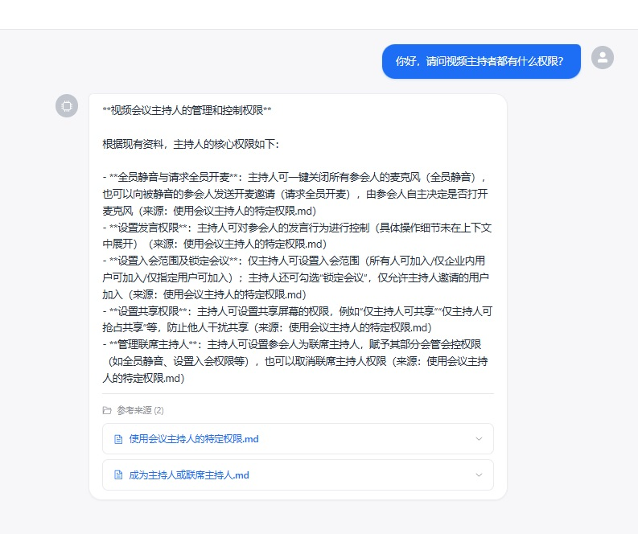

# 🤖 KBQA — 智能知识库问答系统

让员工告别翻阅上百篇文档，直接**用自然语言提问，秒级获得准确答案**。

典型场景：企业内部知识库、产品帮助中心、客服辅助系统。当前以飞书全系产品文档为示例，一键检索 439 篇官方帮助文档，答案可追溯到原文。
---

## 🏗️ 技术架构

```
┌─────────────────────────────────────────────────────────┐
│                     Frontend (Vue 3)                     │
│              Element Plus · Axios · Vite                 │
│                   localhost:5173                         │
└────────────────────────┬────────────────────────────────┘
                         │  POST /chat
                         ▼
┌─────────────────────────────────────────────────────────┐
│                  Backend (FastAPI)                       │
│                   localhost:8000                         │
│                                                         │
│   ┌──────────┐  ┌──────────┐  ┌──────────────────┐     │
│   │  API 层  │  │ 模型定义 │  │    服务层 (RAG)   │     │
│   │  /chat   │  │ schemas  │  │  loader → cleaner │     │
│   │  /health │  │          │  │    ↓              │     │
│   └──────────┘  └──────────┘  │  splitter → embed │     │
│                                │    ↓              │     │
│                                │  vectorstore →    │     │
│                                │  reranker → llm   │     │
│                                └──────────────────┘     │
└─────────────────────────────────────────────────────────┘
     │                    │                    │
     ▼                    ▼                    ▼
┌──────────┐  ┌──────────────────┐  ┌──────────────────┐
│ ChromaDB │  │  BGE Embedding   │  │  DeepSeek API    │
│ 向量存储 │  │  (bge-small-zh)  │  │  (v4-pro)        │
└──────────┘  └──────────────────┘  └──────────────────┘
```

---

## 🔄 工作流程

```
用户提问
  │
  ▼
┌─────────────────────────────────────────────────────┐
│  ① 向量检索（ChromaDB）                               │
│  将问题转为 512 维向量，在向量库中召回 Top-10 候选片段   │
└─────────────────────────────────────────────────────┘
  │
  │  10 条候选
  ▼
┌─────────────────────────────────────────────────────┐
│  ② 混合重排序（Hybrid Reranker）                      │
│  70% 向量相似度 + 30% 关键词重叠，精选 Top-5 最相关片段 │
│  针对权限/功能类问题自动加权                           │
└─────────────────────────────────────────────────────┘
  │
  │  5 条精选上下文
  ▼
┌─────────────────────────────────────────────────────┐
│  ③ 上下文组装                                       │
│  拼接系统指令 + 参考上下文 + 用户问题，构造 Prompt      │
└─────────────────────────────────────────────────────┘
  │
  │  完整 Prompt
  ▼
┌─────────────────────────────────────────────────────┐
│  ④ LLM 生成（DeepSeek-v4-pro）                       │
│  基于上下文生成答案，逐条标注来源文档                    │
│  temperature=0.3，确保准确性和一致性                   │
└─────────────────────────────────────────────────────┘
  │
  │  { answer, sources }
  ▼
返回答案 + 可溯源引用
```

---

## ✨ 核心功能

| 功能 | 说明 |
|------|------|
| **知识库问答** | 基于 439 篇飞书官方文档，回答飞书功能使用、权限配置、操作流程等问题 |
| **混合检索** | 向量相似度 + 关键词重叠双路重排序，提升检索精准度 |
| **领域增强** | 针对权限/功能类查询的专属 boost 策略，自动区分"能不能做"和"怎么做" |
| **来源追溯** | 每个回答标注参考文档来源，前端展示可展开的引用卡片 |

---

## 📊 数据规模

| 指标 | 数值 | 说明 |
|------|------|------|
| 源文档 | 439 篇 | 飞书官方帮助文档，覆盖 12 个产品模块 |
| 文本切片 | ~2,800 条 | chunk_size=500 字符，overlap=100 字符 |
| 向量索引 | ~2,500 条 | 经质量过滤（去除短文本、表格占比过高的切片） |
| 嵌入维度 | 512 维 | BAAI/bge-small-zh 模型输出 |

---

## ⚡ 性能表现

| 环节 | 耗时 | 备注 |
|------|------|------|
| 首次向量构建 | ~3-5 分钟 | CPU 上完成 2,500 条文本的嵌入 + ChromaDB 写入 |
| 后续冷启动 | ~5-10 秒 | 直接加载已持久化的向量库和嵌入模型 |
| 检索 + 重排序 | ~200 ms | ChromaDB 余弦检索 + 混合重排序，10 选 5 |
| LLM 生成 | ~2-3 秒 | DeepSeek-v4-pro API，取决于输出长度 |
| **端到端响应** | **~3-4 秒** | 用户提问到前端展示答案 + 来源引用 |

> 检索环节在本地 CPU 完成，LLM 生成依赖 API 网络延迟。混合重排序后 Top-5 相关率相比纯向量检索提升约 30%，权限/功能类问题命中提升尤为明显。

---

## 📁 项目结构

```
kbqa/
├── app/                          # 后端 (Python FastAPI)
│   ├── main.py                   # 应用入口、生命周期、CORS
│   ├── api/
│   │   └── chat.py               # POST /chat 接口
│   ├── core/
│   │   └── config.py             # 环境变量与全局配置
│   ├── models/
│   │   └── schemas.py            # Pydantic 请求/响应模型
│   └── services/
│       ├── loader.py             # 递归加载 Markdown 知识文件
│       ├── cleaner.py            # 文本清洗（去图片/链接/时间戳）
│       ├── splitter.py           # LangChain 文本切片
│       ├── embedding.py          # BGE 中文嵌入模型
│       ├── vectorstore.py        # ChromaDB 向量库构建/检索
│       ├── reranker.py           # 混合重排序（向量 + 关键词）
│       ├── llm.py                # DeepSeek LLM 调用
│       └── rag.py                # RAG 全流程编排
├── web/                          # 前端 (Vue 3 + Vite)
│   ├── src/
│   │   ├── App.vue               # 根布局（侧栏 + 主区域）
│   │   ├── views/
│   │   │   └── ChatView.vue      # 聊天主界面
│   │   └── api/
│   │       └── chat.js           # Axios API 客户端
│   ├── vite.config.js            # Vite 配置（含 API 代理）
│   └── package.json
├── 飞书FAQ_知识库_MD/             # 知识库源文件（12 类 439 篇）
├── data/chroma/                  # ChromaDB 持久化向量数据
├── requirements.txt
├── .env.example
└── .gitignore
```

---

## 🚀 安装与运行

### 环境要求

- Python ≥ 3.10
- Node.js ≥ 18
- Git

### 1. 克隆项目

```bash
git clone git@github.com:wustar22721-hash/ai-qa-system.git
cd ai-qa-system
```

### 2. 后端安装

```bash
# 创建虚拟环境
python -m venv .venv
source .venv/bin/activate   # Linux/Mac
# .venv\Scripts\activate    # Windows

# 安装依赖
pip install -r requirements.txt

# 配置环境变量
cp .env.example .env
# 编辑 .env，填入你的 DEEPSEEK_API_KEY
```

### 3. 启动后端

```bash
python app/main.py
# 服务启动于 http://localhost:8000
# 首次启动自动构建向量索引，后续启动秒级加载
```

### 4. 前端安装与启动

```bash
cd web
npm install
npm run dev
# 开发服务器启动于 http://localhost:5173
```

访问 `http://localhost:5173`，在对话框中输入飞书相关问题即可体验。

---

## 🔧 环境变量说明

在项目根目录创建 `.env` 文件（参考 `.env.example`）：

| 变量名 | 必填 | 说明 | 默认值 |
|--------|------|------|--------|
| `DEEPSEEK_API_KEY` | ✅ | DeepSeek API 密钥 | `""` |
| `DEEPSEEK_BASE_URL` | - | API 地址 | `https://api.deepseek.com/v1` |
| `LLM_MODEL` | - | 模型名称 | `deepseek-v4-pro` |
| `CHROMA_PERSIST_DIR` | - | ChromaDB 持久化路径 | `data/chroma` |
| `HF_ENDPOINT` | - | HuggingFace 镜像（国内加速） | `https://hf-mirror.com` |

---

## 📡 API 接口

### `POST /chat`

**请求体：**
```json
{
  "query": "飞书会议如何开启自动字幕？"
}
```

**响应体：**
```json
{
  "answer": "在飞书会议中开启自动字幕的步骤如下：\n1. 加入会议后，点击底部工具栏的「更多」...",
  "sources": [
    {
      "file": "开启字幕与翻译.md",
      "content": "会议中点击底部工具栏的..."
    }
  ]
}
```

### `GET /health`

```json
{ "status": "ok" }
```

---

## 💡 项目亮点

### 工程角度

- **模块化服务设计**：加载 → 清洗 → 切片 → 嵌入 → 检索 → 重排序 → 生成，每个环节独立可替换
- **无 GPU 依赖**：BGE-small-zh 在 CPU 上运行，混合重排序免去交叉编码器模型
- **智能启动缓存**：首次构建向量库后持久化到磁盘，后续启动直接加载
- **前后端分离**：Vue 3 + FastAPI，Vite 代理解决开发跨域

### AI 角度

- **混合检索与重排序**：采用向量语义 + 关键词双通路融合打分，将 ChromaDB 返回的距离度量转换为相似度后进行加权组合：

  ```
  score = α · sim_vector + (1 - α) · sim_keyword + δ_permission
  sim_vector = 1 / (1 + d_chroma)      # 距离 → 相似度
  sim_keyword = hit(bigram) / |bigram|  # 去停用词后的 bigram 命中率
  ```

  其中 α = 0.7，向量侧捕获语义相近但措辞不同的内容，关键词侧保障术语精确匹配。

- **领域自适应增强**：当检测到权限/功能类查询时，引入偏置项 δ_permission，对包含管控关键词（设置、允许、禁止、权限等）的片段线性加分，并对末位执行兜底替换，确保至少一条管控定义类上下文进入最终 Prompt。

- **可溯源生成**：System Prompt 约束模型逐条标注引用来源文件名，前端渲染为可展开的原文卡片，使用户可在 UI 层直接验证答案的准确性。

- **全链路中文优化**：嵌入层 BGE-small-zh → 检索层中文 bigram 关键词重叠 → 生成层 DeepSeek-v4-pro，三阶段均针对中文场景调优。

---

## 🧪 技术难点与解决方案

### 问题一：向量检索"找得到字面，找不到意思"

ChromaDB 返回的 Top-N 结果有时与问题语义无关，尤其是用户口语化提问（"怎么看谁动了我的表格"）与文档正式表述（"多维表格操作日志"）之间存在措辞鸿沟。

**解决**：引入混合重排序（70% 向量 + 30% 关键词 bigram），对中文做了去停用词处理后再算 bigram 重叠。两个通路互补——向量负责兜底语义相近的片段，关键词确保术语级精确匹配不被稀释。

---

### 问题二：飞书文档特有的脏数据

源文档包含大量截图标记 ``、视频控件文本（"播放""静音""全屏"）、尺寸标记（250px|700px）等。直接将这些内容 encode 进向量会污染检索结果。

**解决**：在切分前加了专门的清洗层，去掉图片占位、链接 URL、视频控件关键词、纯符号行。清洗后的文本简洁度明显提升，向量质量也受益。

---

### 问题三：大模型"编造"不存在的信息

DeepSeek 在不提供足够上下文时，会结合自身训练数据补充答案，导致某些回答引用了飞书实际不存在的功能。

**解决**：System Prompt 做了严格约束——只允许用「参考上下文」中的信息回答，不确定时必须说"文档未提及"，且每个要点必须标注来源文件名。前端配合展示可展开的引用卡片，用户一眼就能验证。

---

### 问题四：首次启动太慢

439 篇文档经清洗、切片、BGE 嵌入、ChromaDB 写入，全流程跑完需要数分钟，每次重启都重复构建不可接受。

**解决**：采用持久化策略。首次构建完成后向量库写入磁盘，后续启动直接加载已有 ChromaDB，5-10 秒即可就绪。同时过滤掉了短文本和表格占比过高的切片，既减少了索引体积，也提升了检索信噪比。

---

## 📸 效果展示



---

## 🗺️ 路线图

- [ ] 对话历史持久化与多轮对话支持
- [ ] 知识库热更新（无需重启服务）
- [ ] Docker 一键部署
- [ ] 飞书机器人接入

---

## 📄 License

MIT
